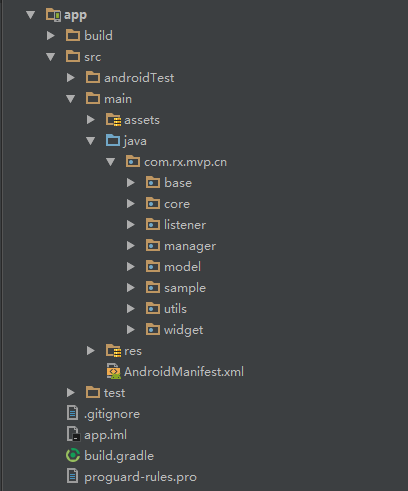
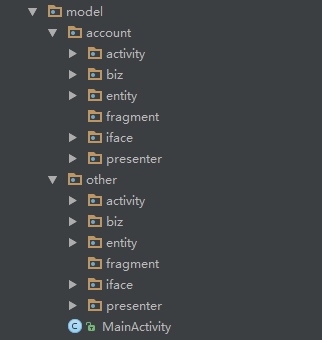

# Rx-Mvp

# RxJava2+Retrofit2+RxLifecycle2使用MVP模式构建项目 #

## 项目包结构

 

  

> base： 一些基础封装类
> 
> core：核心代码 { net(http,socket)-网络 / db-数据库 / bitmap-图片 / view-控件/视图   } 
> 
> model：业务模块 { activity / fragment / presenter / biz-业务处理类 / entity-实体类 / iface-view接口  } 
>        
> sample：各种使用说明，方便项目维护和新人熟悉  eg: httpSample-http请求框架使用示例
> 
> utils：各种工具类
> 
> widget：控件（自定义控件/第三方开源控件）
> 

## RxJava2+Retrofit2+RxLifecycle2

## Api接口 ##
    public interface Api {
	    /**
	     * GET请求
	     *
	     * @param url     api接口url
	     * @param request 请求参数map
	     * @return
	     */
	    @GET
	    Observable<HttpResponse> get(@Url String url, @QueryMap TreeMap<String, Object> request);

	    /**
	     * POST请求
	     *
	     * @param url     api接口url
	     * @param request 请求参数map
	     * @return
	     */
	    @FormUrlEncoded
	    @POST
	    Observable<HttpResponse> post(@Url String url, @FieldMap TreeMap<String, Object> request);
	}


## 定义View接口 ##
    public interface ILoginView extends IBaseView {

	    //显示结果
	    void showResult(UserBean bean);

	}

> 这里有部分开发者可能会认为把 `UserBean` 实体传递给 `View(activity/fragment)` 还是会出现 `model` 跟 `view` 的耦合
> 
> 个人认为，不一定死脑筋非要完全解耦才是实现了 `MVP` 的模式，这里已经实现了不关心 `UserBean` 的来源和构建方式就可以了
> 
> ** # ** 如果非要完全解耦也是可以的 `void showResult(String userName,int userId....)` 要用几个参数就定义几个参数，但是感觉太麻烦了 ** # **
> 


## Request 请求使用方法 ##
    /**
     * 用户登录
     *
     * @param userName
     * @param password
     * @param lifecycle
     * @param callback
     */
    public void login(String userName, String password, LifecycleProvider lifecycle, HttpRxCallback callback) {
        /**
         * 构建请求参数
         */
        TreeMap<String, Object> request = new TreeMap<>();
        request.put("username", userName);
        request.put("password", password);
        request.put(HttpRequest.API_URL, "user/login");

        /**
         * 解析数据
         */
        callback.setParseHelper(new ParseHelper() {
            @Override
            public Object[] parse(JsonElement jsonElement) {
                UserBean bean = new Gson().fromJson(jsonElement, UserBean.class);
                Object[] obj = new Object[1];
                obj[0] = bean;
                return obj;
            }
        });

        /**
         * 发送请求
         */
        new HttpRequest().request(HttpRequest.Method.POST, request, lifecycle, callback);

    }

### 接口地址动态设置 ###

> 
> 构建参数时设置 `HttpRequest.API_URL` 接口名称/路径 等价于: `baseUrl + HttpRequest.API_URL`
> 
> `http://apicloud.mob.com/ (baseUrl)`  ** + ** ` user/login (HttpRequest.API_URL指定的值)`

### request 请求方法 ###
     /**
     * 发送请求
     * 备注:不管理生命周期
     *
     * @param method   请求方式
     * @param prams    参数集合
     * @param callback 回调
     */
    public void request(HttpRequest.Method method, TreeMap<String, Object> prams, HttpRxCallback callback)

    /**
     * 发送请求
     * 备注:自动管理生命周期
     *
     * @param method    请求方式
     * @param lifecycle 实现RxActivity/RxFragment 参数为空不管理生命周期
     * @param prams     参数集合
     * @param callback  回调
     */
    public void request(HttpRequest.Method method, TreeMap<String, Object> prams,
						LifecycleProvider lifecycle, HttpRxCallback callback)


    /**
     * 发送请求
     * 备注:手动指定生命周期-Activity
     *
     * @param method    请求方式
     * @param lifecycle 实现RxActivity
     * @param event     指定生命周期
     * @param prams     参数集合
     * @param callback  回调
     */
    public void request(HttpRequest.Method method, TreeMap<String, Object> prams, 
						LifecycleProvider<ActivityEvent> lifecycle, ActivityEvent event, HttpRxCallback callback)    

## Presenter 中使用 ##
    public class LoginPresenter extends BasePresenter<ILoginView, LoginActivity> {

    	private final String TAG = PhoneAddressPresenter.class.getSimpleName();

	    public LoginPresenter(ILoginView view, LoginActivity activity) {
	        super(view, activity);
	    }

	    public void login(String userName, String password) {
	
	        if (getView() != null)
	            getView().showLoading();
	
	        HttpRxCallback httpRxCallback = new HttpRxCallback(TAG + "login") {
	            @Override
	            public void onSuccess(Object... object) {
	                if (getView() != null) {
	                    getView().closeLoading();
	                    getView().showResult((UserBean) object[0]);
	                }
	            }
	
	            @Override
	            public void onError(int code, String desc) {
	                if (getView() != null) {
	                    getView().closeLoading();
	                    getView().showToast(desc);
	                }
	            }

	            @Override
	            public void onCancel() {
	                if (getView() != null) {
	                    getView().closeLoading();
	                }
	            }
	        };
	
	        new UserBiz().login(userName, password, getActivity(), httpRxCallback);
	
	        /**
	         * ******此处代码为了测试取消请求,不是规范代码*****
	         */
	        /*try {
	            Thread.sleep(50);
	            //取消请求
	            if (!httpRxCallback.isDisposed()) {
	                httpRxCallback.cancel();
	            }
	        } catch (InterruptedException e) {
	            e.printStackTrace();
	        }*/
	    }
	}
 

> 通常情况下使用 `LifecycleProvider` 自动管理生命周期就不需要手动取消请求
> 
> 如果在特殊场景需要开发者取消请求则使用 `httpRxCallback.cancel()`

     /**
     * 文档说明有限
     *
     * 强烈建议阅读代码，在此基础上改造成适用自己项目的框架
     *
     * 欢迎提供建议/意见，不断完善框架
     */


原始构造想法参考博客

**CSDN博客地址：http://blog.csdn.net/u014702653/article/details/75268919**

##License
```
MIT License

Copyright (c) 2018 Ruffian-痞子

Permission is hereby granted, free of charge, to any person obtaining a copy
of this software and associated documentation files (the "Software"), to deal
in the Software without restriction, including without limitation the rights
to use, copy, modify, merge, publish, distribute, sublicense, and/or sell
copies of the Software, and to permit persons to whom the Software is
furnished to do so, subject to the following conditions:

The above copyright notice and this permission notice shall be included in all
copies or substantial portions of the Software.

THE SOFTWARE IS PROVIDED "AS IS", WITHOUT WARRANTY OF ANY KIND, EXPRESS OR
IMPLIED, INCLUDING BUT NOT LIMITED TO THE WARRANTIES OF MERCHANTABILITY,
FITNESS FOR A PARTICULAR PURPOSE AND NONINFRINGEMENT. IN NO EVENT SHALL THE
AUTHORS OR COPYRIGHT HOLDERS BE LIABLE FOR ANY CLAIM, DAMAGES OR OTHER
LIABILITY, WHETHER IN AN ACTION OF CONTRACT, TORT OR OTHERWISE, ARISING FROM,
OUT OF OR IN CONNECTION WITH THE SOFTWARE OR THE USE OR OTHER DEALINGS IN THE
SOFTWARE.
```